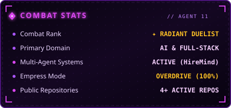
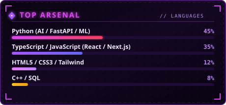
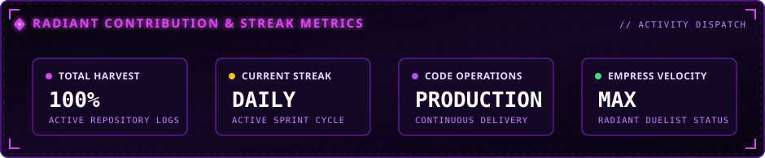
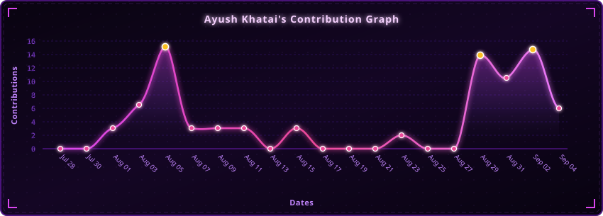

  <!-- Reyna Aesthetic Waving Gradient Header Banner -->
  

   

  <!-- Reyna / Valorant Protocol Tag -->
  

    
    
    
  

  # Hi, I'm Ayush 👋

  ### 🔮 AI & Full-Stack Developer

  <!-- Dynamic Typing Subtitle -->
  

   

  <!-- Connect & Views Badges -->
  

    
    
  

 

---

## ⚡ Building useful things with AI and the web

I build practical, intelligent products that turn complex workflows into clear, accessible experiences. My work spans AI-assisted applications, full-stack systems, and data-driven tools.

<table>
<tr>
<td width="50%" valign="top">

### 🔭 Current focus

- 🔮 **Multi-agent AI applications** & LLM orchestration
- ⚡ **Full-stack product development** (React, Next.js, FastAPI, Node.js)
- 🧠 **Machine learning systems** & intelligent backend pipelines
- 🎨 **Accessible, polished web experiences** with responsive UI

</td>
<td width="50%" valign="top">

### 🤝 Open to

- 🚀 **Open-source collaboration** & innovative repositories
- 💼 **AI and software engineering internships**
- 🏆 **Hackathons and product builds**
- 💬 **Thoughtful engineering conversations** & tech discussions

</td>
</tr>
</table>

 

---

## ⚡ Tech Stack

#### 💎 Languages & Core

  
  
  
  
  
  
  

#### 🔮 AI, Frameworks & Full-Stack

  
  
  
  
  
  

#### ⚡ Databases & Tactical Tools

  
  
  
  
  
  
  

 

---

## 🚀 Selected Work & Operations

<table>
<tr>
<td width="50%" valign="top">

### 🤖 [HireMind](https://github.com/AyushKhatai/interview-panel-simulator)
**Multi-agent AI interview panel simulator**

A FastAPI-powered intelligent simulation system featuring collaborative AI agents acting as interview panelists. Evaluates candidate responses dynamically across technical depth, system design, and behavioral criteria with actionable feedback.

  
  
  

[**Explore Repository →**](https://github.com/AyushKhatai/interview-panel-simulator)

</td>
<td width="50%" valign="top">

### 🌱 [GreenTrack](https://github.com/AyushKhatai/GreenTrack)
**Sustainability & Eco-Impact Tracker**

A web application designed to track, analyze, and visualize carbon footprints and daily resource usage, empowering users and communities to adopt greener, sustainable habits.

  
  
  

[**Explore Repository →**](https://github.com/AyushKhatai/GreenTrack)

</td>
</tr>
<tr>
<td colspan="2" valign="top">

### 🤝 [SkillShare](https://github.com/AyushKhatai/SkillShare)
**Peer-to-Peer Collaborative Learning Platform**

A dynamic platform fostering community-driven skill sharing and knowledge exchange between mentors and learners with real-time collaboration.

  
  
  

[**Explore Repository →**](https://github.com/AyushKhatai/SkillShare)

</td>
</tr>
</table>

 

---

## 📊 Radiant Combat Metrics & Activity

  <!-- Top 2-Column: Combat Stats & Top Languages -->
  <table border="0" width="100%">
    <tr>
      <td width="50%" align="center" valign="middle">
        
      </td>
      <td width="50%" align="center" valign="middle">
        
      </td>
    </tr>
  </table>

   

  <!-- Contribution & Streak Metrics Card -->
  

    

  <!-- Contribution Activity Line Graph -->
  

 

---

## 📡 Secure Comms & Connections

  
Feel free to reach out for collaborations, project discussions, or tech exchanges:

  

    
    
  

   

  <!-- Footer Waving Gradient Accent -->
  
  
  

    <i>"They will cower!"</i> 
    <b>— REYNA // AGENT 11</b>
  

